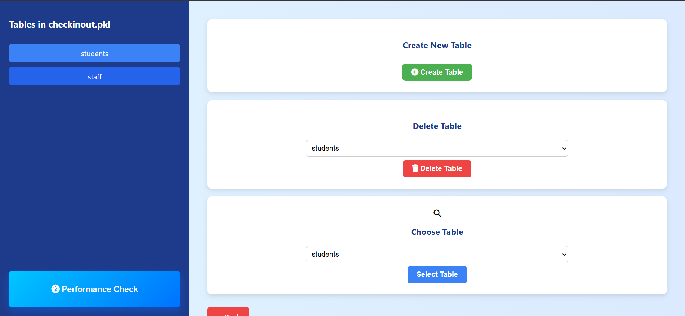

# Database_bplustree
# Database Management System

## Project Overview

Welcome to the **CheckInOut** Database Management System! This project provides a lightweight, file-based database management system featuring:

- Database creation and persistence.
- Table creation and deletion.
- Insert, update, delete, search, and range queries.
- Dashboard interface to manage operations.
- Performance comparison between naive list-based storage and a B+ Tree index.

## 🚀 Beginner Tutorial to Run the App

1. **Clone the Repository:**

```bash
https://https://github.com/WasimKaunain/Database_bplustree
```

2. **Install Dependencies:**

```bash
pip install -r requirements.txt
```

3. **Run the App:**

```bash
python app.py
```

4. **Access the Dashboard:**

Open your browser and go to:

```
http://127.0.0.1:5000/
```

5. **Using the Dashboard:**
   - Choose "Create Database" to create a new one.
   - Choose "Use Existing Database" to select from pre-existing databases (like `checkinout`).
   - Perform operations like insert, update, delete, search, range queries, and display all records easily.

6. **Performance Testing:**
   - Go to the **Performance Check** section.
   - Compare search, insert, delete, and range query times between **Naive List** vs **B+ Tree** using graphs.

---


- # 📸 Screenshot Documentation — CheckInOut System

This document showcases key screenshots from the **CheckInOut System** web application and database performance dashboard. Each section includes visual references along with  brief descriptions.

---

## 🗃️ Database Setup & Management

### 1. Index / Landing Page  
  
Homepage where we have two options : Use an Existing database or create a new database

### 2. Existing Database List and Option to Choose Database  
  
Here we have already two databases named Checkinout and Testing. We will use Checkinout database

### 3. Add New Database  
  
Here we have an option to create a new database by entering its name.

## 🏠 Dashboard & Landing

### 4. Database Dashboard with Tables & Performance Button  
  
This is Database dashboard where left pane shows the list of tables this database have and a Performance Button which takes us to Performance Analyzer dashboard.
Here we have options of Creating new table, deleting a table and Choosing a perticular table.
We will choose here students table as we had populated this table for testing.


### 5. Create New Table Form

Create Table form page


### 6. Table Dashboard with diffrent Functionalities

This is a table dashboard page where various functionalities are given


## 📋 Records Management

### 7. Insert Record  
  
This page is for inserting single records in that selected table

### 8. Display All Records  
  
It will display all the records in that selected table

### 9. Delete Record  
  
It will delete single record in that selected table

### 10. Range Query Results  
  
It will display all the records within that range of selected table

### 11. Search Record  
  
It will display the record being searched in that selected table

### 12. Update Record  
  
It will upfate the record in that selected table

## 📊 Performance Analysis

### 13. Performance Check Dashboard  
  
Here we have multiple performance check options on B+ tree vs Brute Force method indexing.
First, we have to select no. of rows on which we are doing performance check.

### 14. Insertion Time Result Chart  
  
Show Performance Graph on doing insertion between B+ Tree and Brute Force method.

### 15. Deletion Time Result Chart  
  
Show Performance Graph on doing deletion between B+ Tree and Brute Force method.

### 16. Search Time Result Chart  
  
Show Performance Graph on doing searching between B+ Tree and Brute Force method.

### 17. Range Query Time Result Chart  
  
Show Performance Graph on doing range query between B+ Tree and Brute Force method.


## 📂 File Hierarchy

```
Module 4/
|
|-- database/
|   |-- templates/
|   |   |-- update_record.html
|
|-- Tests/
|   |-- __pycache__/
|   |-- performance_test.py
|   |-- performance_test-1.py
|   |-- test_bplustree.py
|   |-- __init__.py
|   |-- manual_test.py
|
|-- app.py
|-- bplustree.py
|-- bruteforce.py
|-- db_manager.py
|-- performance.py
|-- tables.py
|-- performance_plots/
|   |-- students_search_times.png
|-- README.md
|-- report.ipynb
|-- requirements.txt
```

---

## ✨ Features

- **Dashboard Interface:**
  - **Create Database:** Create a new database from scratch.
  - **Use Existing Database:** View and operate on existing databases.

- **Pre-loaded Database:**
  - **Database:** `checkinout`
  - **Tables:** `students`, `staff`

- **Operations Supported:**
  - Create and delete databases.
  - Create and delete tables.
  - Insert new records.
  - Update existing records.
  - Delete records.
  - Search records.
  - Perform range queries.
  - Display all records.

- **Persistence:**
  - All databases and tables are **saved** and can be **loaded** even after restarting the application.

- **Performance Analysis Section:**
  - Compare B+ Tree indexing vs naive list-based search.
  - Graphical analysis for:
    - Insertion
    - Searching
    - Deletion
    - Range Query

---


## 📊 Technologies Used

- **Python**
- **Flask** (for dashboard web interface)
- **HTML/CSS** (for simple frontend forms)
- **Matplotlib** (for performance plotting)
- **Custom Database Management System** (developed from scratch)
- **B+ Tree Data Structure** (for indexing and fast searching)

---

## 💡 Final Notes

This project aims to mimic real-world database operations with a minimalistic and understandable design. It is ideal for beginners who want to:
- Learn how database management systems work internally.
- Understand indexing concepts through practical examples.
- See the impact of data structures on performance.

